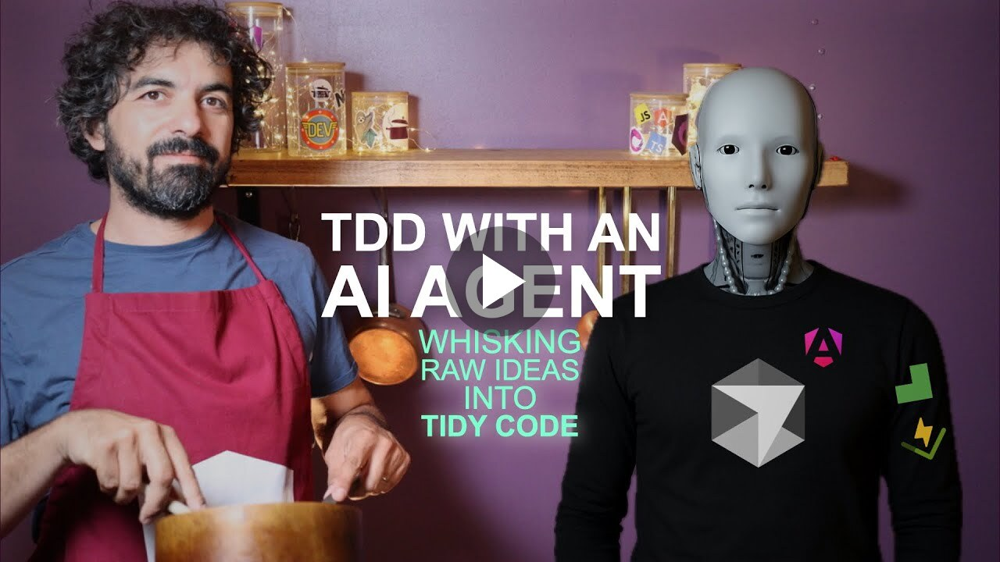

# Charted Coding Skills

**Charted Coding** is a workflow that turns feature ideas into production code through incremental steps — each backed by a dedicated AI skill. Small steps mean, focused and fast prompts, less review fatigue, less context-switching fatigue, and less token usage.

<div align="center">
  <a href="https://www.youtube.com/watch?v=8z9tUsSoros">
    
  </a>
</div>

<table>
<thead>
<tr><th width="200">Skill</th><th>Description</th></tr>
</thead>
<tbody>
<tr><td><a href="#1-design"><code>charted-design</code></a></td><td>Interviews the user section by section to collaboratively produce design documents. Use when creating a design doc, starting feature design, or when the user invokes the design command.</td></tr>
<tr><td><a href="#2-review"><code>charted-review</code></a></td><td>Reviews a design doc with expert sub-agents</td></tr>
<tr><td><a href="#3-scaffold"><code>charted-scaffold</code></a></td><td>Writes work-in-progress code and tests based on design doc</td></tr>
<tr><td><a href="#4-red"><code>charted-red</code></a></td><td>Writes the next failing test based on provided design doc and existing todo tests</td></tr>
<tr><td><a href="#5-green"><code>charted-green</code></a></td><td>Progressively activates todo tests one at a time, updates implementation code until each passes (verified via Wallaby), then moves to the next—following the design doc as the single source of truth.</td></tr>
</tbody>
</table>

## Installation

```sh
npx skills add marmicode/skills
```

## The Charted Coding Steps

The five steps form a linear pipeline. Each step produces an artifact that feeds into the next.

```
design --> review --> scaffold --> red --> green
```

### 1. Design

> Skill: `charted-design`

Everything starts with a **design document**. The AI **interviews you** section by section — goals, non-goals, desired behavior, architecture (with Mermaid diagrams), testing strategy, and a PR plan — then writes the result to `design-docs/`. You stay in the driver's seat: every section is drafted, shown to you, and only committed to the document once you approve it.

**Why this matters:** A design doc forces you to think through the problem _before_ writing code. It captures decisions, constraints, and scope so nothing is lost or assumed.
The interview process reduces oversight risk.

**Produces:** a design document (e.g. `design-docs/001-user-auth.md`)

### 2. Review

> Skill: `charted-review`

The design doc is sent to **expert sub-agents in parallel**:

| Expert               | Focus                                                      |
| -------------------- | ---------------------------------------------------------- |
| Accessibility Expert | WCAG compliance, ARIA, keyboard navigation, screen readers |
| Security Analyst     | Input validation, injection, auth gaps, data exposure      |
| UX Expert            | Interaction patterns, error states, cognitive load         |
| XP Coach             | Testability, incremental delivery, simplicity, YAGNI       |

Their feedback is synthesized into a single review. When experts disagree, a **challenge round** forces them to defend or revise their positions. Unresolved conflicts are escalated to you for the final call.

**Why this matters:** You get a multi-perspective review _before_ a single line of code is written, catching accessibility oversights, security gaps, UX pitfalls, and over-engineering early.

**Produces:** a consolidated review with action items

### 3. Scaffold

> Skill: `charted-scaffold`

The AI reads the (now reviewed) design doc and generates the **skeleton** of the implementation:

- Classes, components, services, and functions are created but **throw `"🚧 work in progress"` errors** instead of doing real work.
- New code is tagged with `@deprecated 🚧 work in progress` so it stands out.
- **No behavior is added or changed** — this is pure structure.
- Test files are created with `it.todo(...)` stubs whose bodies contain the step-by-step instructions from the design doc's testing strategy, written as comments.

**Why this matters:** Scaffolding separates _where things go_ from _how they work_. It lets you review the file structure, naming, and API surface in a focused PR before any logic exists.

**Produces:** WIP source files + `it.todo(...)` test files

### 4. Red

> Skill: `charted-red`

Now the TDD cycle begins. The AI picks the **next `it.todo(...)` test**, reads the comment instructions inside it, and replaces them with **real test code** — assertions, setup, teardown — while keeping the test disabled (`it.todo`).

- Only one test is written at a time.
- The test is implemented but **not enabled** yet.
- No production code is written or changed.

**Why this matters:** This is the _Red_ phase of Red-Green-Refactor. You write a test that _would_ fail if it were enabled, precisely defining the next slice of behavior before implementing it.

**Produces:** a fully implemented (but still `.todo`) test

### 5. Green

> Skill: `charted-green`

The AI activates the test (converts `it.todo(...)` to `it(...)`) and writes **just enough production code** to make it pass, verified in real time via the Wallaby test runner. Once green, it moves to the next implemented test and repeats.

- One test at a time — no skipping ahead.
- Only code required by the current test is written.
- Empty or comment-only tests are ignored.

**Why this matters:** This is the _Green_ phase. By implementing the minimum code to satisfy each test, you get a provably correct, incrementally built feature with no dead code.

**Produces:** passing tests + minimal production code

## License

MIT
